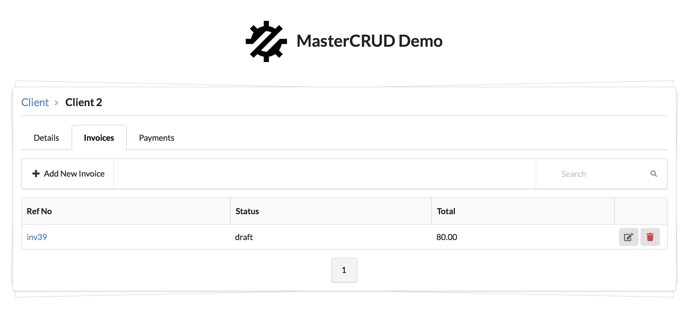
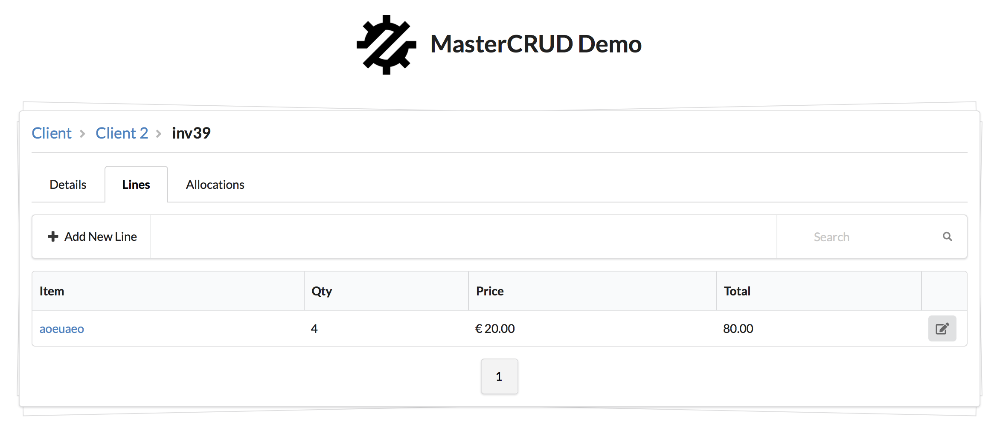

[ATK UI](https://github.com/atk4/ui) is a UI library for building UI interfaces that has a built-in [CRUD](http://ui.agiletoolkit.org/demos/crud.php) component. It can be used to create complex admin systems, but it requires you to populate multiple pages and inter-link them together yourself. 


**MasterCRUD** is an add-on for ATK UI and ATK Data, which will orchestrate navigation between multiple CRUD pages by respecting relations and conditions. You can use **MasterCRUD** to:

-   Manage list of clients, and their individual invoices and payments.
-   Manage user groups and users within them
-   Manage multi-level catalogue and products in them

The syntax of **MasterCRUD** is incredibly simple and short. It automatically takes care of many details like:

-   record and track `id` of various records you have clicked on (BreadCrumb)
-   display multi-Tab pages with model details and optional relations
-   support `hasOne` and `hasMany` relations
-   allow flexible linking to a higher tree level (user - invoice - allocated_payment -> payment (drops invoice_id))

**MasterCRUD** can also be extended to contain your own views, you can interact with the menu and even place **MasterCRUD** inside a more complex layouts.

### Example Use Case (see demos/clients.php for full demo):

MasterCRUD operates like a regular CRUD, and you can easily substitute it in:

``` php
$crud = $app->add('\atk4\mastercrud\MasterCRUD');
$crud->setModel('Client');
```

You'll noticed that you can now click on the client name to get full details about this client. Next, we want to be able to see and manage Client invoices:

``` php
$crud = $app->add('\atk4\mastercrud\MasterCRUD');
$crud->setModel('Client', ['Invoices'=>[]]);
```

This will add 2nd tab to the "Client Details" screen listing invoices of said client. If you invoice is further broken down into "Lines", you can go one level deeper:

``` php
$crud = $app->add('\atk4\mastercrud\MasterCRUD');
$crud->setModel('Client', ['Invoices'=>['Lines'=>[]]]);
```

If `Client hasMany('Payments')` then you can also add that relation:

``` php
$crud = $app->add('\atk4\mastercrud\MasterCRUD');
$crud->setModel('Client', ['Invoices'=>['Lines'=>[]], 'Payments'=>[]]);
```

So far I've shown you examples of "hasMany" relations, but it's possible to also traverse "hasOne". I am going to clean up the above example into this:

``` php
$crud = $app->add('\atk4\mastercrud\MasterCRUD');
$crud->setModel('Client', [
  'Invoices'=>[
    'Lines'=>[]
  ], 
  'Payments'=>[]
]);
```

Suppose that `Invoice hasMany(Allocation)`and `Payment hasMany(Allocation)` while allocation can have one Payment and one Invoice.

``` php
$crud = $app->add('\atk4\mastercrud\MasterCRUD');
$crud->setModel('Client', [
  'Invoices'=>[
    'Lines'=>[],
    'Allocations'=>[]
  ], 
  'Payments'=>[
    'Allocations'=>[]
  ]
]);
```

That's cool, but if you go through the route of `Invoice -> allocation ->` you should be able to click on the "payment":

``` php
$crud = $app->add('\atk4\mastercrud\MasterCRUD');
$crud->setModel('Client', [
  'Invoices'=>[
    'Lines'=>[],
    'Allocations'=>[
      'payment_id'=>['path'=>'Payments', 'payment_id'=>'payment_id']
    ]
  ], 
  'Payments'=>[
    'Allocations'=>[
      'invoice_id'=>['path'=>'Invoices', 'invoice_id'=>'invoice_id']
    ]
  ]
]);
```

Now you will be able to jump from `Invoice->allocation` to `Payment` and other way around.

### Installation

Install through composer (`composer require atk4\mastercrud`).


----------

OLD DOCS


Selecting client shows a detailed view:

 

Although not shown in this reference screenshot, but certain values (such as currency, payee, article, etc) may be configured to be clickable. Next if you open Payments tab, then `$client->ref('Payments')` will be set up for the CRUD:



This can go as deep as necessary.

**CRUDCeption** can also be used with recursive models (which reference themselves)

### Installation and Use

Install through composer (`composer require atk4\crudception`) then use this code:

``` php
$app->add('\atk4\crudception\CRUD');
$app->setModel(
  new Client($app->db), 
  [
    'Payment'=>[
      'Payments',
      'contact_id'=>'/',
      'Allocation'=>[
        // empty means this is just a crud
      ]
      
    ],
    'PayAcc'=>[
      // seeding CRUD / View
      ['\atk4\crudception\CRUD', 'Payments on Account', ['name'], ['name', 'surname']],
    ]
  ]
);
```

If it's unclear from the example above, then `setModel` second argument is passed an array in format: `relation => definition`.

The element with index `0` can be a seed for populating a `atk4\crudception\CRUD`. Other keys must match existing reference within the model. `hasOne` references can be passed a "Path", where '/' refers to the top-most node and then you can specify reference, e.g. `/Payment/Allocation`. All the entity arguments will be passed along: `payment_id=123&allocation_id=234234`. You can make link to a different page by passing array: `['otherpage', 'id'=>'payment_id']`; in which case values of `id` will be mapped to `123`.

For `hasMany` relation, you have to specify an Array or a Callback. If you specify an Array, then it should also contain same definition. You can also specify a path here.

### How does it work

CRUD uses a Callback with 3 triggers - browsing, editing and deleting. CRUDception\CRUD implements another state called `detail` which will be linked to the Title column. 

In this state, Tabs are added and the first column displays a selected model detail with a links to `hasOne` relations. Other tabs will contain `hasMany` relations.


See `demos/` for example usage. The above will have no impact, but will enable you to use other components.

## Roadmap

Generally we wish to keep this add-on clean, but very extensible, with various tutorials on how to implement various scenarios.


